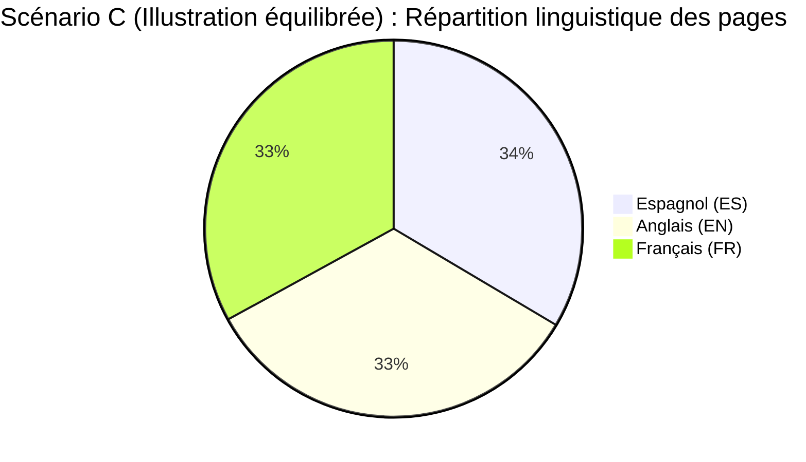

# BOOKFIN — Reconstruction de la Bibliothèque depuis zéro
## Curation humaine · Sources structurées · EPUB-First · V1

**Date :** 13 septembre 2026  
**Auteur du rapport :** Antigravity  
**Statut global :** **DÉCISION ÉDITORIALE HUMAINE VALIDÉE — 73 ŒUVRES ACCEPTÉES (Zéro import exécuté)**  
**Manifeste machine :** [`corpus/curation/library_v1_candidates.json`](../../corpus/curation/library_v1_candidates.json) (127 candidats : **73 `ACCEPTED`, 7 `HOLD`, 47 `PROPOSED`, 0 `REJECTED`**)  
**Matrice de décision complète :** [`docs/reports/BOOKFIN_LIBRARY_CURATION_V1_MATRIX.md`](BOOKFIN_LIBRARY_CURATION_V1_MATRIX.md)  
**Poids et composition réelle :** [`corpus/curation/accepted_weight_simulation.json`](../../corpus/curation/accepted_weight_simulation.json)  

---

## 1. Contexte et principes cardinaux

Nous repartons de zéro pour la bibliothèque éditoriale de Bookfin.  
Cette refondation ne touche **ni le code backend Rust**, **ni le schéma de base de données PostgreSQL**, **ni l'application mobile React Native**, **ni les concepts d'impressions/réactions**, **ni la pagination déterministe**. Elle concerne exclusivement :

> **LA SÉLECTION DES ŒUVRES DU CORPUS.**

L’ancien corpus alpha ne doit plus déterminer ce qui appartient à Bookfin sous prétexte qu’un fichier TXT a été téléchargé ou inséré en base par le passé. La nouvelle bibliothèque est **explicitement et souverainement curatée**.

### Principes directeurs non négociables

1. **Curation des œuvres + Hasard des pages :**  
   L'algorithme ne choisit jamais les œuvres à notre place. La curation décide si une œuvre a sa place dans la bibliothèque Bookfin. Dès lors qu'une œuvre est admise, **toutes ses pages ont le même droit de tirage**. Aucun score de beauté, de popularité ou d'intensité n'altère les probabilités.
2. **La composition du corpus EST l'algorithme :**  
   Bookfin tire uniformément ses pages parmi les œuvres actives des langues sélectionnées. Par conséquent, **le nombre de pages d'une œuvre constitue son poids éditorial réel dans l'urne**. Si un auteur ou une langue est trop dominant(e), la réponse consiste à modifier la composition humaine de la bibliothèque avant l'import, et jamais à masquer cette domination par un coefficient ou une pondération algorithmique secrète.
3. **La distribution linguistique est une conséquence, jamais un objectif automatique :**  
   L'équilibre des langues (par exemple un tiers EN, un tiers FR, un tiers ES) ne doit jamais être un dogme mathématique ou un objectif imposé algorithmiquement. Il doit découler organiquement des choix éditoriaux humains. Aucune œuvre ne sera ajoutée ou retranchée uniquement pour satisfaire une équipartition arithmétique.
4. **Interdiction absolue des anthologies artificielles Bookfin :**  
   Bookfin n'invente jamais d'unités éditoriales artificielles (« sélection d'essais », « morceaux choisis », « extraits », « sélection structurée »). Toute œuvre admise doit correspondre à une **unité éditoriale historiquement autonome et avérée** (roman achevé, recueil complet publié du vivant de l'auteur ou édition posthume de référence, nouvelle ou essai autonome). Tout candidat nécessitant un découpage ou un florilège arbitraire Bookfin est **placé sous statut `HOLD`** dans l'attente d'une délimitation historique explicite.
5. **Règle de source structurée fidèle (EPUB-First sans dogmatisme) :**  
   Pour chaque œuvre retenue, la source structurée la plus fidèle disponible doit être privilégiée selon l'ordre strict :
   1. EPUB fiable correctement balisé ;
   2. HTML / XHTML structuré de qualité éditoriale ;
   3. Source Wikisource structurée (avec référence DjVu/scan) ;
   4. Autre source structurée fiable ;
   5. TXT uniquement en dernier recours documenté (ne plus jamais aplatir EPUB/HTML en TXT brut avant pagination).
6. **Pipeline obligatoire immuable :**  
   `SOURCE STRUCTURÉE (EPUB/HTML/Wikisource) → ARCHIVE SOURCE INTACTE (SHA-256) → NORMALISATION BOOKFIN JSON V2 → PAGINATION BLOCS/SPANS DÉTERMINISTE → PAGES BOOKFIN`.
7. **Aucun import sans validation humaine préalable :**  
   Tous les candidats sont créés au statut `PROPOSED` (ou `HOLD`). Seules les œuvres explicitement marquées `ACCEPTED` par le propriétaire pourront ultérieurement être acquises, normalisées et importées. Zero acceptation automatique.

---

## 2. Manifeste éditorial machine (`library_v1_candidates.json`)

Le fichier machine [`corpus/curation/library_v1_candidates.json`](../../corpus/curation/library_v1_candidates.json) est la source de vérité unique pour la curation.  
Il rassemble 127 œuvres candidates réparties en :
- **49 œuvres longues (`LONG_FORM`)** (romans, essais amples, chroniques, récits de voyage) ;
- **78 œuvres courtes (`SHORT_WORK`)** (nouvelles, contes, novellas, essais autonomes, saynètes dramatiques).

Chaque candidat respecte scrupuleusement le contrat de métadonnées :
```json
{
  "id": "en-austen-pride-prejudice",
  "author": "Jane Austen",
  "title": "Pride and Prejudice",
  "original_language": "en",
  "form": "novel",
  "work_kind": "LONG_FORM",
  "publication_year": 1813,
  "status": "PROPOSED",
  "priority": "P0",
  "preferred_source": "EPUB_IF_STRUCTURALLY_BEST_ELSE_BEST_STRUCTURED_SOURCE",
  "source_provider": "Project Gutenberg",
  "source_url": "https://www.gutenberg.org/ebooks/42671",
  "available_formats": ["EPUB3", "EPUB", "HTML", "plain text"],
  "rights_status": "REVIEW_REQUIRED",
  "rights_basis": "Auteur domaine public (1817). Vérifier PG #42671 (édition Thomson / transcription numérique).",
  "estimated_length": "approx. 690 000 caractères",
  "estimated_bookfin_pages": "380-560",
  "notes": "Œuvre de référence pour le POC technique Corpus V2 (validée à 501 pages Bookfin sans perte).",
  "collection_model": "SINGLE_WORK",
  "source_hash": null
}
```

---

## 3. Premier noyau d'auteurs demandés & œuvres proposées

Le noyau demandé par le propriétaire a été méticuleusement répertorié. Chaque œuvre dispose d'une URL de provenance vérifiée sur Project Gutenberg ou Wikisource, d'une estimation de longueur et d'un dimensionnement en pages Bookfin (base standard : 1 600 caractères/page Bookfin).

### 3.1. Auteurs anglais demandés

| Auteur | Œuvre | Forme / Classe | Année | Pages estimées | Source disponible | Priorité | Statut |
|---|---|---|---|---:|---|:---:|:---:|
| **Jane Austen** | *Pride and Prejudice* | novel · LONG_FORM | 1813 | 380–560 | [Project Gutenberg #42671](https://www.gutenberg.org/ebooks/42671) | P0 | `PROPOSED` |
| Jane Austen | *Persuasion* | novel · LONG_FORM | 1817 | 250–390 | [Project Gutenberg #105](https://www.gutenberg.org/ebooks/105) | P0 | `PROPOSED` |
| Jane Austen | *Northanger Abbey* | novel · LONG_FORM | 1817 | 240–360 | [Project Gutenberg #121](https://www.gutenberg.org/ebooks/121) | P0 | `PROPOSED` |
| Jane Austen | *Emma* | novel · LONG_FORM | 1815 | 480–680 | [Project Gutenberg #158](https://www.gutenberg.org/ebooks/158) | P1 | `PROPOSED` |
| **Samuel Johnson** | *The History of Rasselas, Prince of Abissinia* | novella · SHORT_WORK | 1759 | 100–160 | [Project Gutenberg #652](https://www.gutenberg.org/ebooks/652) | P0 | `PROPOSED` |
| Samuel Johnson | *The Rambler* | essay_collection · LONG_FORM | 1750 | 180–320 | [Project Gutenberg #48651](https://www.gutenberg.org/ebooks/48651) | P1 | `HOLD` |
| Samuel Johnson | *The Idler* | essay_collection · LONG_FORM | 1758 | 150–260 | [Project Gutenberg #12050](https://www.gutenberg.org/ebooks/12050) | P1 | `HOLD` |
| **Laurence Sterne** | *A Sentimental Journey Through France and Italy* | novel · LONG_FORM | 1768 | 130–210 | [Project Gutenberg #107](https://www.gutenberg.org/ebooks/107) | P0 | `PROPOSED` |
| Laurence Sterne | *The Life and Opinions of Tristram Shandy* | novel · LONG_FORM | 1759 | 600–880 | [Project Gutenberg #1079](https://www.gutenberg.org/ebooks/1079) | P1 | `PROPOSED` |
| **Sir Thomas Browne** | *Religio Medici* | essay · SHORT_WORK | 1643 | 110–180 | [Project Gutenberg #586](https://www.gutenberg.org/ebooks/586) | P0 | `PROPOSED` |
| Sir Thomas Browne | *Hydriotaphia, Urn Burial* | essay · SHORT_WORK | 1658 | 65–115 | [Project Gutenberg #32643](https://www.gutenberg.org/ebooks/32643) | P0 | `PROPOSED` |
| Sir Thomas Browne | *The Garden of Cyrus* | essay · SHORT_WORK | 1658 | 70–130 | [Project Gutenberg #2457](https://www.gutenberg.org/ebooks/2457) | P1 | `PROPOSED` |
| **William Hazlitt** | *Table-Talk* | essay_collection · LONG_FORM | 1821 | 300–480 | [Project Gutenberg #4335](https://www.gutenberg.org/ebooks/4335) | P1 | `PROPOSED` |
| William Hazlitt | *The Spirit of the Age* | essay_collection · LONG_FORM | 1825 | 230–360 | [Project Gutenberg #14352](https://www.gutenberg.org/ebooks/14352) | P1 | `PROPOSED` |
| **Sir Richard Francis Burton** | *Personal Narrative of a Pilgrimage to Al-Madinah* | travel · LONG_FORM | 1855 | 700–1050 | [Project Gutenberg #4657](https://www.gutenberg.org/ebooks/4657) | P2 | `PROPOSED` |
| Sir Richard Francis Burton | *First Footsteps in East Africa* | travel · LONG_FORM | 1856 | 360–550 | [Project Gutenberg #6886](https://www.gutenberg.org/ebooks/6886) | P2 | `PROPOSED` |
| **Robert Burton** | *The Anatomy of Melancholy* | essay_collection · LONG_FORM | 1621 | 1100–1700 | [Project Gutenberg #10800](https://www.gutenberg.org/ebooks/10800) | P2 | `PROPOSED` |
| **George Gissing** | *The Private Papers of Henry Ryecroft* | novel/diary · LONG_FORM | 1903 | 180–280 | [Project Gutenberg #2304](https://www.gutenberg.org/ebooks/2304) | P0 | `PROPOSED` |
| George Gissing | *New Grub Street* | novel · LONG_FORM | 1891 | 500–720 | [Project Gutenberg #1709](https://www.gutenberg.org/ebooks/1709) | P1 | `PROPOSED` |
| George Gissing | *The Odd Women* | novel · LONG_FORM | 1893 | 420–620 | [Project Gutenberg #1973](https://www.gutenberg.org/ebooks/1973) | P2 | `PROPOSED` |
| **Henry James** | *The Turn of the Screw* | novella · SHORT_WORK | 1898 | 130–200 | [Project Gutenberg #209](https://www.gutenberg.org/ebooks/209) | P0 | `PROPOSED` |
| Henry James | *Daisy Miller* | novella · SHORT_WORK | 1878 | 80–130 | [Project Gutenberg #208](https://www.gutenberg.org/ebooks/208) | P0 | `PROPOSED` |
| Henry James | *The Beast in the Jungle* | novella · SHORT_WORK | 1903 | 65–105 | [Project Gutenberg #1093](https://www.gutenberg.org/ebooks/1093) | P0 | `PROPOSED` |
| Henry James | *The Aspern Papers* | novella · SHORT_WORK | 1888 | 110–170 | [Project Gutenberg #211](https://www.gutenberg.org/ebooks/211) | P1 | `PROPOSED` |
| Henry James | *The Portrait of a Lady* | novel · LONG_FORM | 1881 | 650–950 | [Project Gutenberg #2833](https://www.gutenberg.org/ebooks/2833) | P1 | `PROPOSED` |

### 3.2. Auteurs français demandés

| Auteur | Œuvre | Forme / Classe | Année | Pages estimées | Source disponible | Priorité | Statut |
|---|---|---|---|---:|---|:---:|:---:|
| **Octave Mirbeau** | *Le Journal d'une femme de chambre* | novel · LONG_FORM | 1900 | 320–480 | [Wikisource](https://fr.wikisource.org/wiki/Le_Journal_d%E2%80%99une_femme_de_chambre) / [PG #43170](https://www.gutenberg.org/ebooks/43170) | P0 | `PROPOSED` |
| Octave Mirbeau | *Le Jardin des supplices* | novel · LONG_FORM | 1899 | 210–330 | [Wikisource](https://fr.wikisource.org/wiki/Le_Jardin_des_supplices) / [PG #47214](https://www.gutenberg.org/ebooks/47214) | P1 | `PROPOSED` |
| Octave Mirbeau | *Farces et moralités* | short_story · SHORT_WORK | 1904 | 80–130 | [Wikisource](https://fr.wikisource.org/wiki/Farces_et_moralit%C3%A9s) | P1 | `PROPOSED` |
| **Guy de Maupassant** | *La Parure* | short_story · SHORT_WORK | 1884 | 8–15 | [Wikisource (Flammarion 1885)](https://fr.wikisource.org/wiki/Contes_du_jour_et_de_la_nuit_(%C3%A9d._Flammarion,_1885)/La_Parure) | P0 | `PROPOSED` |
| Guy de Maupassant | *La Ficelle* | short_story · SHORT_WORK | 1883 | 8–14 | [Wikisource (Havard 1884)](https://fr.wikisource.org/wiki/Miss_Harriet_(recueil)/La_Ficelle) | P0 | `PROPOSED` |
| Guy de Maupassant | *Deux amis* | short_story · SHORT_WORK | 1883 | 8–14 | [Wikisource (Ollendorff 1898)](https://fr.wikisource.org/wiki/Mademoiselle_Fifi_(recueil,_Ollendorff_1898)/Deux_amis) | P0 | `PROPOSED` |
| Guy de Maupassant | *Le Horla* | short_story · SHORT_WORK | 1887 | 30–50 | [Wikisource (Ollendorff 1895)](https://fr.wikisource.org/wiki/Le_Horla_(recueil,_Ollendorff_1895)/Le_Horla) | P0 | `PROPOSED` |
| Guy de Maupassant | *Boule de Suif* | novella · SHORT_WORK | 1880 | 45–70 | [Wikisource](https://fr.wikisource.org/wiki/Boule_de_Suif) | P0 | `PROPOSED` |
| Guy de Maupassant | *La Maison Tellier* | short_story · SHORT_WORK | 1881 | 32–52 | [Wikisource](https://fr.wikisource.org/wiki/La_Maison_Tellier_(recueil)/La_Maison_Tellier) | P1 | `PROPOSED` |
| Guy de Maupassant | *Pierre et Jean* | novel · LONG_FORM | 1888 | 150–230 | [Wikisource](https://fr.wikisource.org/wiki/Pierre_et_Jean) / [PG #1601](https://www.gutenberg.org/ebooks/1601) | P1 | `PROPOSED` |
| Guy de Maupassant | *Bel-Ami* | novel · LONG_FORM | 1885 | 340–520 | [Wikisource](https://fr.wikisource.org/wiki/Bel-Ami) / [PG #7733](https://www.gutenberg.org/ebooks/7733) | P1 | `PROPOSED` |
| **Marcel Schwob** | *Vies imaginaires* | short_story · LONG_FORM | 1896 | 130–220 | [Wikisource](https://fr.wikisource.org/wiki/Vies_imaginaires) / [PG #20241](https://www.gutenberg.org/ebooks/20241) | P0 | `PROPOSED` |
| Marcel Schwob | *Le Livre de Monelle* | novella · SHORT_WORK | 1894 | 65–110 | [Wikisource](https://fr.wikisource.org/wiki/Le_Livre_de_Monelle) | P0 | `PROPOSED` |
| Marcel Schwob | *Cœur double* | short_story · LONG_FORM | 1891 | 140–230 | [Wikisource](https://fr.wikisource.org/wiki/C%C5%93ur_double) | P1 | `PROPOSED` |
| Marcel Schwob | *La Croisade des enfants* | short_story · SHORT_WORK | 1896 | 20–35 | [Wikisource](https://fr.wikisource.org/wiki/La_Croisade_des_enfants) | P1 | `PROPOSED` |
| **Restif de la Bretonne** | *Les Nuits de Paris* | novel · LONG_FORM | 1788 | 500–800 | [Wikisource](https://fr.wikisource.org/wiki/Les_Nuits_de_Paris) / [PG #57885](https://www.gutenberg.org/ebooks/57885) | P1 | `HOLD` |
| Restif de la Bretonne | *La Vie de mon père* | novel · LONG_FORM | 1779 | 210–330 | [Wikisource](https://fr.wikisource.org/wiki/La_Vie_de_mon_p%C3%A8re) / [PG #49174](https://www.gutenberg.org/ebooks/49174) | P2 | `PROPOSED` |
| **Alain-René Lesage** | *Le Diable boiteux* | novel · LONG_FORM | 1707 | 200–320 | [Wikisource](https://fr.wikisource.org/wiki/Le_Diable_boiteux) / [PG #33434](https://www.gutenberg.org/ebooks/33434) | P0 | `PROPOSED` |
| Alain-René Lesage | *Histoire de Gil Blas de Santillane* | novel · LONG_FORM | 1715 | 700–1100 | [Wikisource](https://fr.wikisource.org/wiki/Histoire_de_Gil_Blas_de_Santillane) / [PG #37050](https://www.gutenberg.org/ebooks/37050) | P1 | `PROPOSED` |

### 3.3. Auteur espagnol demandé (Espagnol original exclusivement)

| Auteur | Œuvre | Forme / Classe | Année | Pages estimées | Source disponible | Priorité | Statut |
|---|---|---|---|---:|---|:---:|:---:|
| **Miguel de Cervantes** | *Don Quijote de la Mancha* | novel · LONG_FORM | 1605 | 1000–1500 | [Wikisource](https://es.wikisource.org/wiki/Don_Quijote_de_la_Mancha) / [PG #2000](https://www.gutenberg.org/ebooks/2000) | P0 | `PROPOSED` |
| Miguel de Cervantes | *Novelas ejemplares (recueil complet)* | short_story · LONG_FORM | 1613 | 520–780 | [Wikisource](https://es.wikisource.org/wiki/Novelas_ejemplares) / [PG #40784](https://www.gutenberg.org/ebooks/40784) | P1 | `PROPOSED` |
| Miguel de Cervantes | *Rinconete y Cortadillo* | short_story · SHORT_WORK | 1613 | 38–60 | [Wikisource ES](https://es.wikisource.org/wiki/Rinconete_y_Cortadillo) | P0 | `PROPOSED` |
| Miguel de Cervantes | *La gitanilla* | novella · SHORT_WORK | 1613 | 65–105 | [Wikisource ES](https://es.wikisource.org/wiki/La_gitanilla) | P0 | `PROPOSED` |
| Miguel de Cervantes | *El licenciado Vidriera* | short_story · SHORT_WORK | 1613 | 30–50 | [Wikisource ES](https://es.wikisource.org/wiki/El_licenciado_Vidriera) | P0 | `PROPOSED` |
| Miguel de Cervantes | *El celoso extremeño* | short_story · SHORT_WORK | 1613 | 35–55 | [Wikisource ES](https://es.wikisource.org/wiki/El_celoso_extreme%C3%B1o) | P1 | `PROPOSED` |
| Miguel de Cervantes | *El coloquio de los perros* | short_story · SHORT_WORK | 1613 | 50–80 | [Wikisource ES](https://es.wikisource.org/wiki/El_coloquio_de_los_perros) | P0 | `PROPOSED` |

> [!IMPORTANT]
> **Modèle pour les *Novelas ejemplares* :** Conformément à l'instruction de privilégier le modèle B (œuvres autonomes), les pièces maîtresses des *Novelas ejemplares* ont été distinguées individuellement (*Rinconete y Cortadillo*, *La gitanilla*, *El licenciado Vidriera*, *El celoso extremeño*, *El coloquio de los perros*). L'utilisateur peut ainsi choisir d'importer les nouvelles de son choix sans importer un bloc indifférencié de 800 pages.

---

## 4. Suggestions éditoriales complémentaires (1 à 4 œuvres par auteur)

Ces auteurs fonctionnent remarquablement avec l'expérience Bookfin : **l'ouverture imprévisible à une page frappante**.  
Chaque auteur dispose de 2 à 4 propositions d'œuvres ciblées pour offrir un véritable choix humain.

### 4.1. Suggestions anglaises

- **Charles Lamb :**
  - *Essays of Elia* (1823, 270–420 p., PG #10343) — Prose intime, humoristique et sensible.
  - *The Last Essays of Elia* (1833, 210–330 p., PG #18283) — Deuxième série d'essais prolongeant Elia.
- **Thomas De Quincey :**
  - *Confessions of an English Opium-Eater* (1821, 160–250 p., PG #2040) — Récit autobiographique et visionnaire.
  - *On Murder Considered as one of the Fine Arts* (1827, 45–75 p., Wikisource) — Satire grinçante magistrale.
- **Thomas Love Peacock :**
  - *Headlong Hall* (1816, 95–150 p., PG #9644) — Roman satirique dialogué sur les marottes intellectuelles.
  - *Nightmare Abbey* (1818, 100–160 p., PG #9605) — Parodie brillante de la mélancolie romantique.
- **George Borrow :**
  - *The Bible in Spain* (1843, 600–900 p., PG #418) — Aventures picaresques et pittoresques à travers l'Espagne.
  - *Lavengro* (1851, 580–860 p., PG #361) — Roman d'errance et d'apprentissage parmi les gitans.
- **Walter Pater :**
  - *Studies in the History of the Renaissance* (1873, 180–280 p., PG #4046) — Manifeste de l'esthétisme britannique.
  - *Imaginary Portraits* (1887, 110–180 p., PG #4048) — Portraits biographiques fictifs et poétiques.
- **Oscar Wilde :**
  - *The Picture of Dorian Gray* (1890, 250–380 p., PG #174) — Conte esthétique et moral, étincelant d'aphorismes.
  - *The Happy Prince and Other Tales* (1888, 45–75 p., PG #902) — Contes féeriques d'une pureté poétique bouleversante.
  - *The Decay of Lying* (1889, 30–50 p., Wikisource) — Dialogue philosophique étincelant sur l'art et le réel.
  - *De Profundis* (1905, 90–150 p., PG #873) — Épître carcérale poignante sur la souffrance et la rédemption.
- **Herman Melville :**
  - *Bartleby, the Scrivener* (1853, 45–75 p., PG #11231) — Novella métaphysique majeure (« I would prefer not to »).
  - *Benito Cereno* (1855, 95–150 p., PG #15859) — Mystère maritime et drame psychologique en haute mer.
  - *Moby-Dick* (1851, 680–1000 p., PG #2701) — Épopée cosmique et encyclopédique.

### 4.2. Suggestions françaises

- **Michel de Montaigne :**
  - *Essais — Livre I* (1580, 300–480 p., Wikisource / PG #5614) — **`HOLD`** *(Sélection artificielle Bookfin proscrite ; nécessite soit le Livre I intégral de 57 chapitres, soit des essais autonomes ciblés).*
  - *Essais — Livre III* (1588, 260–400 p., Wikisource) — **`HOLD`** *(Sélection artificielle Bookfin proscrite ; nécessite soit le Livre III intégral de 13 chapitres, soit des essais autonomes ciblés).*
- **Denis Diderot :**
  - *Jacques le fataliste et son maître* (1796, 260–400 p., Wikisource / PG #7916) — L'imprévisibilité et la digression reine.
  - *Le Neveu de Rameau* (1805, 75–125 p., Wikisource / PG #13459) — Dialogue satirique et moral vertigineux.
  - *Supplément au Voyage de Bougainville* (1772, 45–75 p., Wikisource) — Conte philosophique sur la nature humaine.
- **Gérard de Nerval :**
  - *Les Filles du feu (Sylvie)* (1854, 180–280 p., Wikisource / PG #19460) — Prose poétique et souvenirs d'Île-de-France.
  - *Aurélia ou le Rêve et la Vie* (1855, 60–100 p., Wikisource) — Récit onirique halluciné et mystique.
- **Jules Barbey d'Aurevilly :**
  - *Les Diaboliques* (1874, 280–420 p., Wikisource / PG #14496) — Six nouvelles scandaleuses du romantisme noir catholique.
  - *L'Ensorcelée* (1852, 230–360 p., Wikisource / PG #13872) — Légendes normandes et passions tragiques sous la Chouannerie.
- **Auguste Villiers de l'Isle-Adam :**
  - *Contes cruels* (1883, 240–370 p., Wikisource / PG #13853) — Contes grinçants et métaphysiques (*Véra*, *La Torture par l'espérance*).
  - *L'Ève future* (1886, 300–470 p., Wikisource / PG #15799) — Roman fondateur de la SF symboliste (l'Andréide Hadaly).
- **Joris-Karl Huysmans :**
  - *À rebours* (1884, 230–360 p., Wikisource / PG #12379) — Roman d'expérimentations sensorielles thématiques parfait pour Bookfin.
  - *Là-bas* (1891, 340–520 p., Wikisource / PG #15324) — Enquête sur le satanisme et Gilles de Rais.
- **Léon Bloy :**
  - *Le Désespéré* (1887, 320–500 p., Wikisource / PG #18520) — Roman autobiographique d'une violence verbale inouïe.
  - *Histoires désobligeantes* (1894, 110–180 p., Wikisource) — Trente contes féroces contre la bourgeoisie.
- **Stendhal :**
  - *La Chartreuse de Parme* (1839, 520–780 p., Wikisource / PG #4477) — Roman de la passion, du hasard et de l'énergie italienne.
  - *Le Rouge et le Noir* (1830, 500–750 p., Wikisource / PG #4474) — Chronique sociale de la Restauration et destin de Julien Sorel.
  - *Chroniques italiennes* (1839, 170–270 p., Wikisource / PG #15629) — Nouvelles historiques renaissantes sanglantes.
- **François Rabelais :**
  - *Gargantua* (1534, 200–320 p., Wikisource / PG #11786) — Verve carnavalesque et philosophie thélémite.
  - *Pantagruel* (1532, 170–270 p., Wikisource / PG #13589) — Récit picaresque et facéties de Panurge.

### 4.3. Suggestions espagnoles (Espagnol original)

- **Francisco de Quevedo :**
  - *Los sueños* (1627, 150–240 p., Wikisource / PG #41065) — Satire visionnaire des enfers et des vices humains.
  - *Historia de la vida del Buscón* (1626, 160–260 p., Wikisource / PG #24564) — Le grand roman picaresque conceptiste.
- **Mariano José de Larra :**
  - *Artículos de costumbres* (1832, 200–330 p., Wikisource / PG #39886) — **`HOLD`** *(Recueil composite non délimité historiquement ; nécessite soit des articles isolés en SHORT_WORK, soit l'édition posthume complète).*
  - *El doncel de don Enrique el Doliente* (1834, 310–480 p., PG #51184) — Roman romantique historique sur le troubadour Macías.
- **Leopoldo Alas « Clarín » :**
  - *La Regenta* (1884, 950–1400 p., Wikisource / PG #57224) — Chef-d'œuvre du réalisme espagnol (Vetusta).
  - *Su único hijo* (1890, 270–420 p., Wikisource / PG #39678) — Second roman tragico-comique.
  - *¡Adiós, Cordera! y otros cuentos* (1892, 10–18 p., Wikisource) — L'une des plus bouleversantes nouvelles espagnoles.
- **Emilia Pardo Bazán :**
  - *Los pazos de Ulloa* (1886, 300–470 p., Wikisource / PG #35471) — Fresque naturaliste galicienne de la décadence seigneuriale.
  - *La madre naturaleza* (1887, 320–490 p., Wikisource / PG #46377) — Suite tragique des Pazos.
  - *Cuentos de amor* (1898, 100–160 p., Wikisource / PG #35876) — **`HOLD`** *(Recueil de 43 contes non découpé en pièces autonomes ; nécessite soit l'intégrale 1898, soit des contes individuels en SHORT_WORK).*
- **Benito Pérez Galdós :**
  - *Misericordia* (1897, 360–550 p., Wikisource / PG #17387) — Tableau poignant des bas-fonds madrilènes et bonté de Benina.
  - *Doña Perfecta* (1876, 230–360 p., Wikisource / PG #15725) — Drame de l'intolérance provinciale à Orbajosa.
  - *Trafalgar* (1873, 180–280 p., Wikisource / PG #13697) — Épisode national fondateur vu par un adolescent.
- **Miguel de Unamuno :**
  - *Niebla* (1914, 230–360 p., Wikisource / PG #49836) — « Nivola » existentielle où le héros défie son créateur.
  - *San Manuel Bueno, mártir* (1930, 35–60 p., Wikisource) — Novella bouleversante d'un prêtre sans foi qui console autrui.
  - *Amor y pedagogía* (1902, 180–280 p., Wikisource / PG #50314) — Satire féroce du scientisme rigide.
- **Ramón del Valle-Inclán :**
  - *Sonata de otoño* (1902, 70–115 p., Wikisource / PG #37537) — Prose moderniste galicienne crépusculaire.
  - *Sonata de primavera* (1904, 65–105 p., Wikisource / PG #37536) — Aventure en Italie de jeunesse de Bradomín.
  - *Luces de bohemia* (1924, 75–125 p., Wikisource) — Chef-d'œuvre de l'esperpento (la dernière nuit de Max Estrella à Madrid).

### 4.4. Audit des anthologies et décisions de mise en `HOLD` éditoriale

Conformément à la règle cardinale n°4, un audit exhaustif de tous les candidats présentant des caractéristiques d'anthologie, de recueil composite ou d'extraits a été conduit. Sept candidats ont été identifiés comme ne formant pas à ce stade une unité éditoriale historique univoque et ont été **placés sous statut `HOLD`** :

| Identifiant candidat | Auteur & Œuvre | Problème éditorial constaté | Unité éditoriale historique authentique requise | Statut |
|---|---|---|---|:---:|
| `en-johnson-rambler` | Samuel Johnson — *The Rambler* | Les 208 essais originaux (1750–1752) formaient des feuilles bi-hebdomadaires. Un best-of ou une « sélection » Bookfin est proscrit. | Soit intégrale historique en 2/4 volumes originaux (`LONG_FORM`), soit essais numérotés individuels traités en œuvres autonomes (`SHORT_WORK`). | `HOLD` |
| `en-johnson-idler` | Samuel Johnson — *The Idler* | Les 103 essais hebdomadaires (1758–1760) parus dans *The Universal Chronicle* ne peuvent être tronqués arbitrairement. | Soit l'édition originale complète de 1761, soit des numéros isolés comme essais autonomes (`SHORT_WORK`). | `HOLD` |
| `fr-montaigne-essais-livre-1` | Michel de Montaigne — *Essais — Livre I* | Les *Essais* se composent de trois livres historiques complets. Aucune coupe ou sélection ad hoc n'est admissible. | Soit le Livre I complet de 1580 (57 chapitres intégraux), soit des chapitres célèbres isolés en tant qu'essais autonomes (`SHORT_WORK`, ex. *De l'amitié*, *Des cannibales*). | `HOLD` |
| `fr-montaigne-essais-livre-3` | Michel de Montaigne — *Essais — Livre III* | Même motif que pour le Livre I. Une sélection partielle Bookfin trahirait la structure de Montaigne. | Soit le Livre III complet de 1588 (13 chapitres intégraux), soit des chapitres autonomes isolés (`SHORT_WORK`, ex. *De l'incommodité de la grandeur*, *De l'art de conférer*, *De l'expérience*). | `HOLD` |
| `fr-restif-nuits-de-paris` | Restif de la Bretonne — *Les Nuits de Paris* | Ouvrage colossal en 8 tomes (16 parties, 391 nuits). L'entrée PG #57885 ne couvre que les premières parties de manière partielle. | Nécessite un bornage rigoureux par tome historique complet (tome I à VIII) ou par nuit individuelle autonome. | `HOLD` |
| `es-larra-articulos` | Mariano José de Larra — *Artículos de costumbres* | Les articles de mœurs de Larra sont des chroniques de presse parues sous pseudonyme (Fígaro, El Pobrecito Hablador). Aucun volume original unique ne les regroupe tous. | Doivent être intégrés sous forme d'articles autonomes majeurs en `SHORT_WORK` (*Vuelva usted mañana*, *El castellano viejo*, *El casarse pronto y mal*), ou d'après une édition posthume de référence délimitée. | `HOLD` |
| `es-pardo-bazan-cuentos-de-amor` | Emilia Pardo Bazán — *Cuentos de amor* | L'édition originale de 1898 regroupe 43 contes distincts. L'entrée ne doit pas agréger arbitrairement un sous-ensemble. | Soit le recueil complet des 43 contes de 1898 fidèlement balisé, soit les contes les plus remarquables individualisés en `SHORT_WORK`. | `HOLD` |

---

## 5. Rapport complet sur les anciennes nouvelles du corpus pilote / alpha

Les 25 nouvelles qui composaient le petit corpus pilote d'origine ont été analysées individuellement.  
Toutes avaient été précédemment injectées sous forme de **fichiers TXT aplatis**, ayant détruit les italiques, les séparateurs de scène, le balisage des dialogues et la structure de paragraphe.  
Chaque nouvelle a été localisée dans sa source structurée d'origine :

| Auteur | Titre | Langue | Source structurée retrouvée | Édition originale identifiée | Recommandation Corpus V2 |
|---|---|:---:|---|---|---|
| Guy de Maupassant | *La Parure* | fr | Wikisource HTML / DjVu | Flammarion, 1885 (*Contes du jour et de la nuit*) | **Réingérer en V2** (validé en POC : 12 p.) |
| Guy de Maupassant | *La Ficelle* | fr | Wikisource HTML / DjVu | Victor Havard, 1884 (*Miss Harriet*) | **Réingérer en V2** (source propre prête) |
| Guy de Maupassant | *Deux amis* | fr | Wikisource HTML | Ollendorff, 1898 (*Mademoiselle Fifi*) | **Réingérer en V2** |
| Guy de Maupassant | *Menuet* | fr | Wikisource HTML | Rouveyre & Blond, 1883 (*Contes de la bécasse*) | **Réingérer en V2** |
| Guy de Maupassant | *La Folle* | fr | Wikisource HTML | Rouveyre & Blond, 1883 (*Contes de la bécasse*) | **Réingérer en V2** |
| Guy de Maupassant | *Le Horla* | fr | Wikisource HTML | Ollendorff, 1895 (*Le Horla*, version définitive) | **Réingérer en V2** (format journal idéal) |
| Alphonse Daudet | *La chèvre de monsieur Seguin* | fr | Wikisource HTML / DjVu | Hetzel, 1869 (*Lettres de mon moulin*) | **Réingérer en V2** (conte autonome) |
| Alphonse Daudet | *Le secret de maître Cornille* | fr | Wikisource HTML | Hetzel, 1869 (*Lettres de mon moulin*) | **Réingérer en V2** (conte autonome) |
| Alphonse Daudet | *Les trois messes basses* | fr | Wikisource HTML | Hetzel, 1869 (*Lettres de mon moulin*) | **Réingérer en V2** (conte autonome) |
| Prosper Mérimée | *Mateo Falcone* | fr | Wikisource HTML | Revue de Paris, 1829 / Mosaïque 1833 | **Réingérer en V2** |
| Honoré de Balzac | *Une passion dans le désert* | fr | Wikisource HTML | Revue de Paris, 1830 (*Études philosophiques*) | **Optionnel** (qualité littéraire indéniable) |
| Charles Baudelaire | *Enivrez-vous* | fr | Wikisource HTML | Michel Lévy, 1869 (*Le Spleen de Paris*) | **À écarter ou isoler** (trop bref : 1 seule page) |
| Edgar Allan Poe | *The Tell-Tale Heart* | en | Wikisource HTML | The Pioneer, 1843 / Redfield 1850 | **Réingérer en V2** (anglais original) |
| Edgar Allan Poe | *The Cask of Amontillado* | en | Wikisource HTML | Godey's Lady's Book, 1846 / Redfield 1850 | **Réingérer en V2** (anglais original) |
| Edgar Allan Poe | *The Oval Portrait* | en | Wikisource HTML | Graham's Magazine, 1842 / Redfield 1850 | **Réingérer en V2** (anglais original) |
| O. Henry | *The Gift of the Magi* | en | Wikisource HTML | The Four Million, Doubleday 1906 | **Réingérer en V2** (anglais original) |
| O. Henry | *The Last Leaf* | en | Wikisource HTML | The Trimmed Lamp, Doubleday 1907 | **Réingérer en V2** (anglais original) |
| Arthur Conan Doyle | *A Scandal in Bohemia* | en | Project Gutenberg #1661 | The Strand Magazine, 1891 | **Réingérer en V2** (œuvre autonome) |
| Arthur Conan Doyle | *The Red-Headed League* | en | Project Gutenberg #1661 | The Strand Magazine, 1891 | **Réingérer en V2** (œuvre autonome) |
| Jack London | *To Build a Fire* | en | Wikisource HTML / PG #3706 | Century Magazine, 1908 (version longue) | **Réingérer en V2** (anglais original) |
| Saki (H. H. Munro) | *The Open Window* | en | Wikisource HTML | *Beasts and Super-Beasts*, John Lane 1914 | **Réingérer en V2** |
| Kate Chopin | *The Story of an Hour* | en | Wikisource HTML | Vogue, 1894 | **Réingérer en V2** (novella brève) |
| Horacio Quiroga | *A la deriva* | es | Wikisource HTML | Fray Mocho, 1912 / Cuentos de amor 1917 | **Réingérer en V2** (validé en POC : 5 p.) |
| Horacio Quiroga | *El almohadón de plumas* | es | Wikisource HTML | Caras y Caretas, 1907 / Cuentos de amor 1917 | **Réingérer en V2** (espagnol original) |
| Horacio Quiroga | *La insolación* | es | Wikisource HTML | Caras y Caretas, 1908 / Cuentos de amor 1917 | **Réingérer en V2** (espagnol original) |

---

## 6. Preuve de concept technique Corpus V2 (ISO-Production)

Pour démontrer le pipeline sans modifier la base SQL active, une preuve de concept technique rigoureuse a été exécutée via `scripts/build_corpus_v2_poc.py` et validée par les tests unitaires de `scripts/test_corpus_v2.py`.

### 6.1. Comparaison des formats disponibles et rationale de la source retenue

Conformément à la règle cardinale n°5 (EPUB-First sans dogmatisme), nous auditons systématiquement l'ensemble des formats disponibles pour chaque candidat avant d'arrêter le choix de la source d'archive.

| Œuvre (Langue) | Formats structurés disponibles | EPUB disponible ? | HTML disponible ? | Source retenue | SHA-256 de la source intacte | Blocs structurés | Pages Bookfin |
|---|---|:---:|:---:|---|---|---:|---:|
| **Jane Austen**<br>*Pride and Prejudice* (EN) | EPUB3, EPUB (v2), HTML structuré (XHTML), plain text UTF-8 | **OUI**<br>(Génération auto PG) | **OUI**<br>(Master transcription) | **HTML éditorial PG #42671**<br>`en_austen_pride_prejudice_pg42671.html` | `d5cf14a0...33978e` | 2 203 | **501** |
| **Guy de Maupassant**<br>*La Parure* (FR) | Wikisource HTML (transclusion DjVu BnF), Export EPUB dynamique | **Partiel**<br>(Export auto WS) | **OUI**<br>(Fidèle au fac-similé) | **HTML Wikisource DjVu**<br>`fr_maupassant_la_parure_wikisource.html` | `e18a25ee...bd4044` | 151 | **12** |
| **Horacio Quiroga**<br>*A la deriva* (ES) | Wikisource HTML, Export EPUB dynamique | **Partiel**<br>(Export auto WS) | **OUI**<br>(Texte intégral UTF-8) | **HTML Wikisource ES**<br>`es_quiroga_a_la_deriva_wikisource.html` | `61d4771a...f3377d` | 31 | **5** |

### 6.2. Rationale technique approfondie du choix de source

1. **Pourquoi le HTML a été privilégié à l'EPUB pour *Pride and Prejudice* (Gutenberg #42671) :**
   - **Nature de la chaîne Gutenberg :** Sur Project Gutenberg, le fichier HTML/XHTML constitue le document *maître* saisi et corrigé par les transcripteurs humains (ici d'après la célèbre édition illustrée Hugh Thomson de George Allen, 1894). L'EPUB proposé au téléchargement n'est pas un fichier source d'origine, mais une compilation automatisée par des scripts de conversion (outils internes PG / Calibre) qui encapsule et fragmente ce même HTML.
   - **Isolement chirurgical des métadonnées liminaires :** Le fichier HTML de PG #42671 structure les licences et mentions de diffusion Gutenberg dans deux conteneurs identifiés : `<div id="pg-header">` et `<div id="pg-footer">`. L'analyseur Bookfin peut ainsi élaguer ces éléments non auctoriaux à 100 % sans toucher au corps du roman.
   - **Structure des chapitres et sémantique :** Les 61 chapitres du roman sont articulés par des balises d'en-tête explicites (`<h2>` ou `<h3>`), tandis que l'ensemble des dialogues et des italiques expressifs de Jane Austen sont balisés en balises sémantiques (`<em>`, `<i>`).
   - **Déterminisme et robustesse :** Traiter le HTML unifié évite d'avoir à décompresser une archive ZIP multi-fichiers (`mimetype`, `META-INF/container.xml`, `content.opf`, fragments de chapitres `ch01.xhtml`... `ch61.xhtml`) et de risquer des anomalies de recollement de bordures de chapitre, tout en garantissant un partitionnement parfait en 501 pages Bookfin.

2. **Pourquoi le HTML a été privilégié à l'EPUB pour *La Parure* (Wikisource FR) :**
   - **Fidélité au fac-similé BnF :** La page HTML de Wikisource est directement liée au scan DjVu de la Bibliothèque nationale de France (édition Victor Havard 1884 / Flammarion 1885, *Contes du jour et de la nuit*, pp. 73-93).
   - **Instabilité de l'export EPUB Wikisource :** L'outil d'exportation EPUB MediaWiki (« WS-Export ») est un convertisseur générique qui altère régulièrement la hiérarchie des balises et injecte des mentions de licence et styles CSS parasites.
   - **Nettoyage contrôlé :** Le parseur HTML Bookfin écarte spécifiquement les conteneurs `.ws-noexport`, les liens de navigation inter-pages et les en-têtes d'index Wikisource, produisant exactement 12 pages Bookfin d'une pureté absolue.

3. **Pourquoi le HTML a été privilégié à l'EPUB pour *A la deriva* (Wikisource ES) :**
   - **Intégrité diacritique espagnole :** Le flux HTML UTF-8 préserve nativement sans la moindre altération d'encodage les caractères accentués (`á`, `é`, `í`, `ó`, `ú`, `ñ`, `ü`) et la ponctuation expressive inversée (`¡`, `¿`).
   - **Simplicité et concision pour une forme courte :** Avec 31 blocs de paragraphe pour 5 pages Bookfin, l'HTML Wikisource offre une pureté textuelle immédiate, sans la lourdeur d'un conteneur EPUB pour un conte de 5 pages.

### 6.3. Vérifications de fidélité opérées
- **Suppression intégrale de la pollution Gutenberg :** Les balises `#pg-header`, `#pg-footer` et les licences liminaires sont détectées et écartées sans laisser de résidus dans les pages de lecture.
- **Éléments non éditoriaux Wikisource écartés :** Les conteneurs `.ws-noexport`, métadonnées de page et liens de navigation transverses sont ignorés.
- **Préservation des styles et de la sémantique :** Les spans `italic` et `bold` sont encapsulés au sein des blocs `paragraph` sans césure brute de mots ou de balises.
- **Accents et espagnol :** Caractères diacritiques rigoureusement préservés en UTF-8 canonique.
- **Déterminisme strict :** Deux exécutions de pagination produisent un hash SHA-256 de document et un découpage de pages strictement identiques à l'octet près.
- **Isolement total :** Aucun fichier n'a été inséré dans PostgreSQL Railway ; aucun build mobile n'a été déclenché.

---

## 7. Poids réel dans l'urne & simulations de composition

### Règle éditoriale : Le tirage uniforme
Bookfin ne recourt à aucun artifice algorithmique pour masquer un déséquilibre. Le tirage d'une page au sein d'une langue sélectionnée est équiprobable.  
Par conséquent, **le nombre de pages d'une œuvre détermine sa fréquence d'apparition**.

Pour guider le choix éditorial humain, le script `scripts/simulate_curation_weights.py` a simulé 4 scénarios d'ensembles `ACCEPTED` :



> [!IMPORTANT]
> **Ce scénario est une illustration purement indicative, et NON une "cible recommandée" ou un objectif prescriptif.**  
> La distribution linguistique dans Bookfin doit impérativement découler des **décisions souveraines de la curation humaine**, et non d'un automatisme algorithmique cherchant à imposer un tiers / un tiers / un tiers. Aucune œuvre ne doit être ajoutée ou retranchée uniquement pour atteindre un ratio mathématique sans motivation littéraire explicite.  
> *Note de cohérence :* Dans cette simulation illustrative, les candidats mis en `HOLD` pour découpage artificiel (*Artículos de costumbres* et *Cuentos de amor*) ont été écartés et remplacés par des œuvres authentiquement autonomes (*El doncel de don Enrique el Doliente* et *Sonata de estío*).

### Synthèse comparative des scénarios

| Indicateur | Scénario A (Pilote 3 langues) | Scénario B (Noyau P0 brut) | Scénario C (Illustration d'équilibre linguistique) | Scénario D (Catalogue complet exploré) |
|---|---:|---:|---:|---:|
| **Nombre d'œuvres** | 6 œuvres | 42 œuvres | **73 œuvres** (25 longues + 48 courtes) | 127 œuvres |
| **Total pages estimées** | 553,5 pages | 4 985 pages | **12 303,5 pages** | 24 597 pages |
| **Part Anglais (EN)** | 84,91 % | 47,48 % | **33,46 %** | 35,50 % |
| **Part Français (FR)** | 4,07 % | 22,18 % | **33,00 %** | 32,85 % |
| **Part Espagnol (ES)** | 11,02 % | 30,34 % | **33,54 %** | 31,65 % |
| **Part LONG_FORM** | 84,91 % | 71,72 % | **78,03 %** | 84,21 % |
| **Part SHORT_WORK** | 15,09 % | 28,28 % | **21,97 %** | 15,79 % |
| **Dominations (>= 15 %)** | Jane Austen (**84,9 %**) | Cervantes (**29,9 %**), Austen (**21,9 %**) | **AUCUNE (0 auteur >= 15 %)** | Robert Burton (**6,7 %**), Cervantes (**6,2 %**) |

### Enseignement capital des simulations
- **Dans le Scénario B (P0 brut) :** La présence de *Don Quijote* (1 250 p.) et des romans d'Austen (1 090 p.) sans un nombre suffisant de formes longues françaises crée une distorsion majeure : Cervantes représente à lui seul **29,87 %** de tout le tirage et Jane Austen **21,87 %**. L'urne serait presque entièrement saturée par deux auteurs.
- **Dans le Scénario C (Illustration) :** En combinant 25 œuvres longues (8 EN, 9 FR, 8 ES) et 48 œuvres courtes réparties, aucun auteur ne franchit le seuil d'alerte de 15 % (Cervantes culmine à 12,47 %, Henry James à 10,53 %, Stendhal à 7,07 %, Maupassant à 6,45 % et Jane Austen à 6,42 %). Cette simulation prouve que le remède aux monopoles d'auteurs réside dans l'intégration équilibrée de formes longues et courtes, tout en laissant l'arbitrage linguistique final au jugement humain.

---

## 8. Droits et provenance (Quadruple validation obligatoire)

Avant de faire passer un candidat de `PROPOSED` à `ACCEPTED`, une quadruple vérification juridique et technique doit être effectuée :
1. **L'œuvre originale :** Date de décès de l'auteur (règle générale : mort depuis plus de 70 ans au 1er janvier de l'année courante en France et UE, art. L123-1 CPI ; aux États-Unis, au 1er janvier 2026, les œuvres publiées en 1930 ou antérieurement sont entrées dans le domaine public sous le terme général de 95 ans). Attention : cela ne valide pas automatiquement toute édition ultérieure.
2. **L'édition critique retenue :** Une édition critique moderne (notes, appareil de variantes, préface) peut être protégée de façon autonome même si le texte d'origine est libre. Choisir des éditions historiques du domaine public.
3. **La transcription numérique :** Vérifier les conditions d'utilisation du projet numériseur (Wikisource CC-BY-SA/domaine public ; Gutenberg licence de distribution).
4. **La traduction (le cas échéant) :** La présente bibliothèque V1 privilégie **exclusivement les œuvres en langue originale** (Cervantes et Quiroga en espagnol, Austen et James en anglais, Maupassant et Schwob en français). Toute traduction ultérieure exigera l'examen séparé des droits du traducteur.

---

## 9. Décision éditoriale humaine validée & Plan d'acquisition V1

Le propriétaire de Bookfin a souverainement validé le 13 septembre 2026 la composition de la première bibliothèque Bookfin, correspondant aux 73 œuvres issues de la simulation C (après substitution des œuvres placées en `HOLD`).

### 9.1. État des statuts du manifeste
- **ACCEPTED :** 73 œuvres (validées pour l'acquisition et la normalisation V2)
- **HOLD :** 7 œuvres (maintenues en attente de délimitation éditoriale historique)
- **PROPOSED :** 47 œuvres (en réserve éditoriale pour de futures extensions)
- **REJECTED :** 0 œuvre
- **Total candidats :** 127 œuvres

### 9.2. Vérification des unités éditoriales
L'audit technique des 73 œuvres validées confirme qu'elles constituent toutes des **unités éditoriales réelles et authentiques** :
- **21 romans complets** (*Don Quijote*, *Pride and Prejudice*, *The Portrait of a Lady*, *La Chartreuse de Parme*, etc.) ;
- **13 novellas complètes** (*The Turn of the Screw*, *Daisy Miller*, *Boule de Suif*, *San Manuel Bueno, mártir*, etc.) ;
- **33 nouvelles autonomes** (*La Parure*, *La Ficelle*, *Rinconete y Cortadillo*, *The Tell-Tale Heart*, *A Scandal in Bohemia*, etc.) ;
- **3 recueils d'essais historiques complets** (*Essays of Elia*, *Table-Talk*, *Los sueños*) ;
- **2 essais autonomes** (*Religio Medici*, *Hydriotaphia*) ;
- **1 drame en prose** (*Luces de bohemia*).
Aucun florilège ou découpage ad hoc Bookfin n'a été conservé dans les 73 ACCEPTED. Les 7 entrées problématiques restent isolées en `HOLD`.

### 9.3. Statistiques descriptives de composition réelle
- **Nombre d'œuvres :** 73
- **Pages estimées cumulées :** 12 303,5 pages Bookfin
- **Répartition par langue :**
  - Espagnol (ES) : 33,54 % (21 œuvres, 4 126,5 pages)
  - Anglais (EN) : 33,46 % (26 œuvres, 4 117,0 pages)
  - Français (FR) : 33,00 % (26 œuvres, 4 060,0 pages)
- **Répartition par classe de longueur :**
  - Formes longues (`LONG_FORM`) : 78,03 % (25 œuvres, 9 600,0 pages)
  - Formes courtes (`SHORT_WORK`) : 21,97 % (48 œuvres, 2 703,5 pages)
- **Top 10 Auteurs (sur 37 auteurs au total) :**
  1. Miguel de Cervantes : 1 534,0 p. (12,47 %)
  2. Henry James : 1 295,0 p. (10,53 %)
  3. Stendhal : 870,0 p. (7,07 %)
  4. Guy de Maupassant : 793,0 p. (6,45 %)
  5. Jane Austen : 790,0 p. (6,42 %)
  6. Benito Pérez Galdós : 750,0 p. (6,10 %)
  7. Denis Diderot : 430,0 p. (3,49 %)
  8. Francisco de Quevedo : 405,0 p. (3,29 %)
  9. Octave Mirbeau : 400,0 p. (3,25 %)
  10. Mariano José de Larra : 395,0 p. (3,21 %)
- **Top 10 Œuvres (sur 73 œuvres au total) :**
  1. *Don Quijote de la Mancha* (Cervantes) : 1 250,0 p. (10,16 %)
  2. *The Portrait of a Lady* (James) : 800,0 p. (6,50 %)
  3. *La Chartreuse de Parme* (Stendhal) : 650,0 p. (5,28 %)
  4. *Pride and Prejudice* (Austen) : 470,0 p. (3,82 %)
  5. *Misericordia* (Galdós) : 455,0 p. (3,70 %)
  6. *Bel-Ami* (Maupassant) : 430,0 p. (3,49 %)
  7. *Le Journal d'une femme de chambre* (Mirbeau) : 400,0 p. (3,25 %)
  8. *El doncel de don Enrique el Doliente* (Larra) : 395,0 p. (3,21 %)
  9. *Table-Talk* (Hazlitt) : 390,0 p. (3,17 %)
  10. *Los pazos de Ulloa* (Pardo Bazán) : 385,0 p. (3,13 %)

### 9.4. Plan d'acquisition source par source (73 œuvres ACCEPTED)

| N° | Identifiant | Auteur | Titre | Langue | Forme & Classe | Source retenue | EPUB dispo ? | HTML dispo ? | Format recommandé | URL vérifiée | Droits | Taille approx. | Priorité |
|---:|---|---|---|:---:|---|---|:---:|:---:|---|---|:---:|---|:---:|
| 1 | `en-austen-pride-prejudice` | Jane Austen | *Pride and Prejudice* | en | novel · LONG_FORM | Project Gutenberg | OUI | OUI | HTML (master transcription PG #42671 validée POC) | [Project Gutenberg](https://www.gutenberg.org/ebooks/42671) | REVIEW_REQUIRED | approx. 690 000 caractères (380-560 p.) | P0 |
| 2 | `en-austen-persuasion` | Jane Austen | *Persuasion* | en | novel · LONG_FORM | Project Gutenberg | OUI | OUI | EPUB3 | [Project Gutenberg](https://www.gutenberg.org/ebooks/105) | REVIEW_REQUIRED | approx. 470 000 caractères (250-390 p.) | P0 |
| 3 | `en-johnson-rasselas` | Samuel Johnson | *The History of Rasselas, Prince of Abissinia* | en | novella · SHORT_WORK | Project Gutenberg | OUI | OUI | HTML structuré | [Project Gutenberg](https://www.gutenberg.org/ebooks/652) | REVIEW_REQUIRED | approx. 195 000 caractères (100-160 p.) | P0 |
| 4 | `en-sterne-sentimental-journey` | Laurence Sterne | *A Sentimental Journey Through France and Italy* | en | novel · LONG_FORM | Project Gutenberg | OUI | OUI | EPUB3 | [Project Gutenberg](https://www.gutenberg.org/ebooks/107) | REVIEW_REQUIRED | approx. 240 000 caractères (130-210 p.) | P0 |
| 5 | `en-browne-religio-medici` | Sir Thomas Browne | *Religio Medici* | en | essay · SHORT_WORK | Project Gutenberg | OUI | OUI | HTML structuré | [Project Gutenberg](https://www.gutenberg.org/ebooks/586) | REVIEW_REQUIRED | approx. 210 000 caractères (110-180 p.) | P0 |
| 6 | `en-browne-hydriotaphia` | Sir Thomas Browne | *Hydriotaphia, Urn Burial* | en | essay · SHORT_WORK | Project Gutenberg | OUI | OUI | HTML structuré | [Project Gutenberg](https://www.gutenberg.org/ebooks/32643) | REVIEW_REQUIRED | approx. 115 000 caractères (65-115 p.) | P0 |
| 7 | `en-hazlitt-table-talk` | William Hazlitt | *Table-Talk* | en | essay_collection · LONG_FORM | Project Gutenberg | OUI | OUI | EPUB3 | [Project Gutenberg](https://www.gutenberg.org/ebooks/4335) | REVIEW_REQUIRED | approx. 560 000 caractères (300-480 p.) | P1 |
| 8 | `en-gissing-henry-ryecroft` | George Gissing | *The Private Papers of Henry Ryecroft* | en | novel · LONG_FORM | Project Gutenberg | OUI | OUI | EPUB3 | [Project Gutenberg](https://www.gutenberg.org/ebooks/2304) | REVIEW_REQUIRED | approx. 330 000 caractères (180-280 p.) | P0 |
| 9 | `en-james-portrait-of-a-lady` | Henry James | *The Portrait of a Lady* | en | novel · LONG_FORM | Project Gutenberg | OUI | OUI | EPUB3 | [Project Gutenberg](https://www.gutenberg.org/ebooks/2833) | REVIEW_REQUIRED | approx. 1 200 000 caractères (650-950 p.) | P1 |
| 10 | `en-james-turn-of-the-screw` | Henry James | *The Turn of the Screw* | en | novella · SHORT_WORK | Project Gutenberg | OUI | OUI | HTML structuré | [Project Gutenberg](https://www.gutenberg.org/ebooks/209) | REVIEW_REQUIRED | approx. 240 000 caractères (130-200 p.) | P0 |
| 11 | `en-james-daisy-miller` | Henry James | *Daisy Miller* | en | novella · SHORT_WORK | Project Gutenberg | OUI | OUI | HTML structuré | [Project Gutenberg](https://www.gutenberg.org/ebooks/208) | REVIEW_REQUIRED | approx. 140 000 caractères (80-130 p.) | P0 |
| 12 | `en-james-beast-in-the-jungle` | Henry James | *The Beast in the Jungle* | en | novella · SHORT_WORK | Project Gutenberg | OUI | OUI | HTML structuré | [Project Gutenberg](https://www.gutenberg.org/ebooks/1093) | REVIEW_REQUIRED | approx. 110 000 caractères (65-105 p.) | P0 |
| 13 | `en-james-aspern-papers` | Henry James | *The Aspern Papers* | en | novella · SHORT_WORK | Project Gutenberg | OUI | OUI | HTML structuré | [Project Gutenberg](https://www.gutenberg.org/ebooks/211) | REVIEW_REQUIRED | approx. 190 000 caractères (110-170 p.) | P1 |
| 14 | `fr-mirbeau-journal-femme-chambre` | Octave Mirbeau | *Le Journal d'une femme de chambre* | fr | novel · LONG_FORM | Wikisource / Project Gutenberg | OUI | OUI | HTML structuré | [Wikisource / Project Gutenberg](https://fr.wikisource.org/wiki/Le_Journal_d%E2%80%99une_femme_de_chambre) | REVIEW_REQUIRED | approx. 580 000 caractères (320-480 p.) | P0 |
| 15 | `fr-maupassant-bel-ami` | Guy de Maupassant | *Bel-Ami* | fr | novel · LONG_FORM | Wikisource / Project Gutenberg | OUI | OUI | HTML structuré | [Wikisource / Project Gutenberg](https://fr.wikisource.org/wiki/Bel-Ami) | REVIEW_REQUIRED | approx. 620 000 caractères (340-520 p.) | P1 |
| 16 | `fr-maupassant-pierre-et-jean` | Guy de Maupassant | *Pierre et Jean* | fr | novel · LONG_FORM | Wikisource / Project Gutenberg | OUI | OUI | HTML structuré | [Wikisource / Project Gutenberg](https://fr.wikisource.org/wiki/Pierre_et_Jean) | REVIEW_REQUIRED | approx. 270 000 caractères (150-230 p.) | P1 |
| 17 | `fr-maupassant-la-parure` | Guy de Maupassant | *La Parure* | fr | short_story · SHORT_WORK | Wikisource | NON | OUI | HTML Wikisource (DjVu BnF validé POC) | [Wikisource](https://fr.wikisource.org/wiki/Contes_du_jour_et_de_la_nuit_(%C3%A9d._Flammarion,_1885)/La_Parure) | REVIEW_REQUIRED | 16 220 caractères (8-15 p.) | P0 |
| 18 | `fr-maupassant-la-ficelle` | Guy de Maupassant | *La Ficelle* | fr | short_story · SHORT_WORK | Wikisource | NON | OUI | HTML structuré (Wikisource UTF-8) | [Wikisource](https://fr.wikisource.org/wiki/Miss_Harriet_(recueil)/La_Ficelle) | REVIEW_REQUIRED | 13 360 caractères (8-14 p.) | P0 |
| 19 | `fr-maupassant-deux-amis` | Guy de Maupassant | *Deux amis* | fr | short_story · SHORT_WORK | Wikisource | NON | OUI | HTML structuré (Wikisource UTF-8) | [Wikisource](https://fr.wikisource.org/wiki/Mademoiselle_Fifi_(recueil,_Ollendorff_1898)/Deux_amis) | REVIEW_REQUIRED | 13 120 caractères (8-14 p.) | P0 |
| 20 | `fr-maupassant-le-horla` | Guy de Maupassant | *Le Horla* | fr | short_story · SHORT_WORK | Wikisource | NON | OUI | HTML structuré (Wikisource UTF-8) | [Wikisource](https://fr.wikisource.org/wiki/Le_Horla_(recueil,_Ollendorff_1895)/Le_Horla) | REVIEW_REQUIRED | 53 000 caractères (30-50 p.) | P0 |
| 21 | `fr-maupassant-boule-de-suif` | Guy de Maupassant | *Boule de Suif* | fr | novella · SHORT_WORK | Wikisource | NON | OUI | HTML structuré (Wikisource UTF-8) | [Wikisource](https://fr.wikisource.org/wiki/Boule_de_Suif) | REVIEW_REQUIRED | 78 000 caractères (45-70 p.) | P0 |
| 22 | `fr-maupassant-la-maison-tellier` | Guy de Maupassant | *La Maison Tellier* | fr | short_story · SHORT_WORK | Wikisource | NON | OUI | HTML structuré (Wikisource UTF-8) | [Wikisource](https://fr.wikisource.org/wiki/La_Maison_Tellier_(recueil)/La_Maison_Tellier) | REVIEW_REQUIRED | 58 000 caractères (32-52 p.) | P1 |
| 23 | `fr-schwob-vies-imaginaires` | Marcel Schwob | *Vies imaginaires* | fr | short_story · LONG_FORM | Wikisource / Project Gutenberg | OUI | OUI | HTML structuré | [Wikisource / Project Gutenberg](https://fr.wikisource.org/wiki/Vies_imaginaires) | REVIEW_REQUIRED | approx. 240 000 caractères (130-220 p.) | P0 |
| 24 | `fr-schwob-livre-de-monelle` | Marcel Schwob | *Le Livre de Monelle* | fr | novella · SHORT_WORK | Wikisource | NON | OUI | HTML structuré (Wikisource UTF-8) | [Wikisource](https://fr.wikisource.org/wiki/Le_Livre_de_Monelle) | REVIEW_REQUIRED | approx. 110 000 caractères (65-110 p.) | P0 |
| 25 | `fr-schwob-croisade-des-enfants` | Marcel Schwob | *La Croisade des enfants* | fr | short_story · SHORT_WORK | Wikisource | NON | OUI | HTML structuré (Wikisource UTF-8) | [Wikisource](https://fr.wikisource.org/wiki/La_Croisade_des_enfants) | REVIEW_REQUIRED | approx. 35 000 caractères (20-35 p.) | P1 |
| 26 | `fr-lesage-diable-boiteux` | Alain-René Lesage | *Le Diable boiteux* | fr | novel · LONG_FORM | Wikisource / Project Gutenberg | OUI | OUI | HTML structuré | [Wikisource / Project Gutenberg](https://fr.wikisource.org/wiki/Le_Diable_boiteux) | REVIEW_REQUIRED | approx. 380 000 caractères (200-320 p.) | P0 |
| 27 | `es-cervantes-quijote` | Miguel de Cervantes | *Don Quijote de la Mancha* | es | novel · LONG_FORM | Wikisource / Project Gutenberg | OUI | OUI | HTML structuré | [Wikisource / Project Gutenberg](https://es.wikisource.org/wiki/Don_Quijote_de_la_Mancha) | REVIEW_REQUIRED | approx. 1 950 000 caractères (1000-1500 p.) | P0 |
| 28 | `es-cervantes-rinconete-y-cortadillo` | Miguel de Cervantes | *Rinconete y Cortadillo* | es | short_story · SHORT_WORK | Wikisource | NON | OUI | HTML structuré (Wikisource UTF-8) | [Wikisource](https://es.wikisource.org/wiki/Rinconete_y_Cortadillo) | REVIEW_REQUIRED | approx. 68 000 caractères (38-60 p.) | P0 |
| 29 | `es-cervantes-la-gitanilla` | Miguel de Cervantes | *La gitanilla* | es | novella · SHORT_WORK | Wikisource | NON | OUI | HTML structuré (Wikisource UTF-8) | [Wikisource](https://es.wikisource.org/wiki/La_gitanilla) | REVIEW_REQUIRED | approx. 115 000 caractères (65-105 p.) | P0 |
| 30 | `es-cervantes-el-licenciado-vidriera` | Miguel de Cervantes | *El licenciado Vidriera* | es | short_story · SHORT_WORK | Wikisource | NON | OUI | HTML structuré (Wikisource UTF-8) | [Wikisource](https://es.wikisource.org/wiki/El_licenciado_Vidriera) | REVIEW_REQUIRED | approx. 52 000 caractères (30-50 p.) | P0 |
| 31 | `es-cervantes-el-celoso-extremeno` | Miguel de Cervantes | *El celoso extremeño* | es | short_story · SHORT_WORK | Wikisource | NON | OUI | HTML structuré (Wikisource UTF-8) | [Wikisource](https://es.wikisource.org/wiki/El_celoso_extreme%C3%B1o) | REVIEW_REQUIRED | approx. 62 000 caractères (35-55 p.) | P1 |
| 32 | `es-cervantes-el-coloquio-de-los-perros` | Miguel de Cervantes | *El coloquio de los perros* | es | short_story · SHORT_WORK | Wikisource | NON | OUI | HTML structuré (Wikisource UTF-8) | [Wikisource](https://es.wikisource.org/wiki/El_coloquio_de_los_perros) | REVIEW_REQUIRED | approx. 90 000 caractères (50-80 p.) | P0 |
| 33 | `es-quiroga-a-la-deriva` | Horacio Quiroga | *A la deriva* | es | short_story · SHORT_WORK | Wikisource | NON | OUI | HTML Wikisource (UTF-8 validé POC) | [Wikisource](https://es.wikisource.org/wiki/A_la_deriva) | REVIEW_REQUIRED | 6 180 caractères (4-8 p.) | P0 |
| 34 | `es-quiroga-el-almohadon-de-plumas` | Horacio Quiroga | *El almohadón de plumas* | es | short_story · SHORT_WORK | Wikisource | NON | OUI | HTML structuré (Wikisource UTF-8) | [Wikisource](https://es.wikisource.org/wiki/El_almohad%C3%B3n_de_pluma) | REVIEW_REQUIRED | 7 200 caractères (4-8 p.) | P0 |
| 35 | `es-quiroga-la-insolacion` | Horacio Quiroga | *La insolación* | es | short_story · SHORT_WORK | Wikisource | NON | OUI | HTML structuré (Wikisource UTF-8) | [Wikisource](https://es.wikisource.org/wiki/La_insolaci%C3%B3n) | REVIEW_REQUIRED | 13 700 caractères (8-15 p.) | P0 |
| 36 | `fr-merimee-mateo-falcone` | Prosper Mérimée | *Mateo Falcone* | fr | short_story · SHORT_WORK | Wikisource | NON | OUI | HTML structuré (Wikisource UTF-8) | [Wikisource](https://fr.wikisource.org/wiki/Mateo_Falcone) | REVIEW_REQUIRED | 25 900 caractères (15-25 p.) | P0 |
| 37 | `fr-merimee-carmen` | Prosper Mérimée | *Carmen* | fr | novella · SHORT_WORK | Wikisource / Project Gutenberg | OUI | OUI | HTML structuré | [Wikisource / Project Gutenberg](https://fr.wikisource.org/wiki/Carmen) | REVIEW_REQUIRED | approx. 130 000 caractères (70-120 p.) | P1 |
| 38 | `fr-daudet-chevre-seguin` | Alphonse Daudet | *La chèvre de monsieur Seguin* | fr | short_story · SHORT_WORK | Wikisource | NON | OUI | HTML structuré (Wikisource UTF-8) | [Wikisource](https://fr.wikisource.org/wiki/Lettres_de_mon_moulin/La_ch%C3%A8vre_de_monsieur_Seguin) | REVIEW_REQUIRED | 11 400 caractères (6-12 p.) | P0 |
| 39 | `fr-daudet-secret-cornille` | Alphonse Daudet | *Le secret de maître Cornille* | fr | short_story · SHORT_WORK | Wikisource | NON | OUI | HTML structuré (Wikisource UTF-8) | [Wikisource](https://fr.wikisource.org/wiki/Lettres_de_mon_moulin/Le_secret_de_ma%C3%AEtre_Cornille) | REVIEW_REQUIRED | 11 300 caractères (6-12 p.) | P0 |
| 40 | `fr-daudet-trois-messes-basses` | Alphonse Daudet | *Les trois messes basses* | fr | short_story · SHORT_WORK | Wikisource | NON | OUI | HTML structuré (Wikisource UTF-8) | [Wikisource](https://fr.wikisource.org/wiki/Lettres_de_mon_moulin/Les_trois_messes_basses) | REVIEW_REQUIRED | 16 300 caractères (10-18 p.) | P0 |
| 41 | `en-poe-tell-tale-heart` | Edgar Allan Poe | *The Tell-Tale Heart* | en | short_story · SHORT_WORK | Wikisource | NON | OUI | HTML structuré (Wikisource UTF-8) | [Wikisource](https://en.wikisource.org/wiki/Mystery_Tales_of_Edgar_Allan_Poe/The_Tell-Tale_Heart) | REVIEW_REQUIRED | 11 100 caractères (6-12 p.) | P0 |
| 42 | `en-poe-cask-amontillado` | Edgar Allan Poe | *The Cask of Amontillado* | en | short_story · SHORT_WORK | Wikisource | NON | OUI | HTML structuré (Wikisource UTF-8) | [Wikisource](https://en.wikisource.org/wiki/The_Works_of_the_Late_Edgar_Allan_Poe_(1850)/Volume_1/The_Cask_of_Amontillado) | REVIEW_REQUIRED | 12 900 caractères (7-14 p.) | P0 |
| 43 | `en-poe-oval-portrait` | Edgar Allan Poe | *The Oval Portrait* | en | short_story · SHORT_WORK | Wikisource | NON | OUI | HTML structuré (Wikisource UTF-8) | [Wikisource](https://en.wikisource.org/wiki/The_Works_of_the_Late_Edgar_Allan_Poe_(1850)/Volume_1/The_Oval_Portrait) | REVIEW_REQUIRED | 7 200 caractères (4-8 p.) | P0 |
| 44 | `en-doyle-scandal-bohemia` | Arthur Conan Doyle | *A Scandal in Bohemia* | en | short_story · SHORT_WORK | Project Gutenberg / Wikisource | OUI | OUI | HTML structuré | [Project Gutenberg / Wikisource](https://www.gutenberg.org/ebooks/1661) | REVIEW_REQUIRED | 47 600 caractères (26-44 p.) | P0 |
| 45 | `en-doyle-red-headed-league` | Arthur Conan Doyle | *The Red-Headed League* | en | short_story · SHORT_WORK | Project Gutenberg / Wikisource | OUI | OUI | HTML structuré | [Project Gutenberg / Wikisource](https://www.gutenberg.org/ebooks/1661) | REVIEW_REQUIRED | 50 300 caractères (28-48 p.) | P0 |
| 46 | `en-london-to-build-a-fire` | Jack London | *To Build a Fire* | en | short_story · SHORT_WORK | Wikisource / Project Gutenberg | OUI | OUI | HTML structuré | [Wikisource / Project Gutenberg](https://en.wikisource.org/wiki/Century_Magazine/Volume_76/Issue_4/To_Build_a_Fire) | REVIEW_REQUIRED | 38 000 caractères (22-36 p.) | P0 |
| 47 | `en-henry-gift-of-the-magi` | O. Henry | *The Gift of the Magi* | en | short_story · SHORT_WORK | Wikisource | NON | OUI | HTML structuré (Wikisource UTF-8) | [Wikisource](https://en.wikisource.org/wiki/The_Gift_of_the_Magi) | REVIEW_REQUIRED | 11 300 caractères (6-12 p.) | P0 |
| 48 | `en-henry-last-leaf` | O. Henry | *The Last Leaf* | en | short_story · SHORT_WORK | Wikisource | NON | OUI | HTML structuré (Wikisource UTF-8) | [Wikisource](https://en.wikisource.org/wiki/The_Last_Leaf_(Henry)) | REVIEW_REQUIRED | 12 800 caractères (7-13 p.) | P0 |
| 49 | `en-saki-open-window` | Saki (H. H. Munro) | *The Open Window* | en | short_story · SHORT_WORK | Wikisource | NON | OUI | HTML structuré (Wikisource UTF-8) | [Wikisource](https://en.wikisource.org/wiki/The_Open_Window_(Saki)) | REVIEW_REQUIRED | 6 800 caractères (4-8 p.) | P0 |
| 50 | `en-chopin-story-of-an-hour` | Kate Chopin | *The Story of an Hour* | en | short_story · SHORT_WORK | Wikisource | NON | OUI | HTML structuré (Wikisource UTF-8) | [Wikisource](https://en.wikisource.org/wiki/The_Story_of_an_Hour) | REVIEW_REQUIRED | 5 600 caractères (3-6 p.) | P0 |
| 51 | `en-lamb-essays-of-elia` | Charles Lamb | *Essays of Elia* | en | essay_collection · LONG_FORM | Project Gutenberg | OUI | OUI | EPUB3 | [Project Gutenberg](https://www.gutenberg.org/ebooks/10343) | REVIEW_REQUIRED | approx. 490 000 caractères (270-420 p.) | SUGGESTION |
| 52 | `en-wilde-dorian-gray` | Oscar Wilde | *The Picture of Dorian Gray* | en | novel · LONG_FORM | Project Gutenberg | OUI | OUI | EPUB3 | [Project Gutenberg](https://www.gutenberg.org/ebooks/174) | REVIEW_REQUIRED | approx. 440 000 caractères (250-380 p.) | SUGGESTION |
| 53 | `en-melville-bartleby` | Herman Melville | *Bartleby, the Scrivener* | en | short_story · SHORT_WORK | Wikisource / Project Gutenberg | OUI | OUI | HTML structuré | [Wikisource / Project Gutenberg](https://www.gutenberg.org/ebooks/11231) | REVIEW_REQUIRED | approx. 80 000 caractères (45-75 p.) | SUGGESTION |
| 54 | `fr-diderot-jacques-le-fataliste` | Denis Diderot | *Jacques le fataliste et son maître* | fr | novel · LONG_FORM | Wikisource / Project Gutenberg | OUI | OUI | HTML structuré | [Wikisource / Project Gutenberg](https://fr.wikisource.org/wiki/Jacques_le_fataliste_et_son_ma%C3%AEtre) | REVIEW_REQUIRED | approx. 480 000 caractères (260-400 p.) | SUGGESTION |
| 55 | `fr-diderot-neveu-de-rameau` | Denis Diderot | *Le Neveu de Rameau* | fr | novel · SHORT_WORK | Wikisource / Project Gutenberg | OUI | OUI | HTML structuré | [Wikisource / Project Gutenberg](https://fr.wikisource.org/wiki/Le_Neveu_de_Rameau) | REVIEW_REQUIRED | approx. 140 000 caractères (75-125 p.) | SUGGESTION |
| 56 | `fr-nerval-aurelia` | Gérard de Nerval | *Aurélia ou le Rêve et la Vie* | fr | novella · SHORT_WORK | Wikisource | NON | OUI | HTML structuré (Wikisource UTF-8) | [Wikisource](https://fr.wikisource.org/wiki/Aur%C3%A9lia) | REVIEW_REQUIRED | approx. 110 000 caractères (60-100 p.) | SUGGESTION |
| 57 | `fr-barbey-les-diaboliques` | Jules Barbey d'Aurevilly | *Les Diaboliques* | fr | short_story · LONG_FORM | Wikisource / Project Gutenberg | OUI | OUI | HTML structuré | [Wikisource / Project Gutenberg](https://fr.wikisource.org/wiki/Les_Diaboliques) | REVIEW_REQUIRED | approx. 510 000 caractères (280-420 p.) | SUGGESTION |
| 58 | `fr-huysmans-a-rebours` | Joris-Karl Huysmans | *À rebours* | fr | novel · LONG_FORM | Wikisource / Project Gutenberg | OUI | OUI | HTML structuré | [Wikisource / Project Gutenberg](https://fr.wikisource.org/wiki/%C3%80_rebours) | REVIEW_REQUIRED | approx. 420 000 caractères (230-360 p.) | SUGGESTION |
| 59 | `fr-bloy-histoires-desobligeantes` | Léon Bloy | *Histoires désobligeantes* | fr | short_story · SHORT_WORK | Wikisource | NON | OUI | HTML structuré (Wikisource UTF-8) | [Wikisource](https://fr.wikisource.org/wiki/Histoires_d%C3%A9sobligeantes) | REVIEW_REQUIRED | approx. 210 000 caractères (110-180 p.) | SUGGESTION |
| 60 | `fr-stendhal-chartreuse-de-parme` | Stendhal | *La Chartreuse de Parme* | fr | novel · LONG_FORM | Wikisource / Project Gutenberg | OUI | OUI | HTML structuré | [Wikisource / Project Gutenberg](https://fr.wikisource.org/wiki/La_Chartreuse_de_Parme) | REVIEW_REQUIRED | approx. 980 000 caractères (520-780 p.) | SUGGESTION |
| 61 | `fr-stendhal-chroniques-italiennes` | Stendhal | *Chroniques italiennes* | fr | short_story · SHORT_WORK | Wikisource / Project Gutenberg | OUI | OUI | HTML structuré | [Wikisource / Project Gutenberg](https://fr.wikisource.org/wiki/Chroniques_italiennes) | REVIEW_REQUIRED | approx. 320 000 caractères (170-270 p.) | SUGGESTION |
| 62 | `es-quevedo-los-suenos` | Francisco de Quevedo | *Los sueños* | es | essay_collection · LONG_FORM | Wikisource / Project Gutenberg | OUI | OUI | HTML structuré | [Wikisource / Project Gutenberg](https://es.wikisource.org/wiki/Los_sue%C3%B1os) | REVIEW_REQUIRED | approx. 270 000 caractères (150-240 p.) | SUGGESTION |
| 63 | `es-quevedo-el-buscon` | Francisco de Quevedo | *Historia de la vida del Buscón* | es | novel · LONG_FORM | Wikisource / Project Gutenberg | OUI | OUI | HTML structuré | [Wikisource / Project Gutenberg](https://es.wikisource.org/wiki/Historia_de_la_vida_del_Busc%C3%B3n) | REVIEW_REQUIRED | approx. 290 000 caractères (160-260 p.) | SUGGESTION |
| 64 | `es-larra-el-doncel` | Mariano José de Larra | *El doncel de don Enrique el Doliente* | es | novel · LONG_FORM | Project Gutenberg | OUI | OUI | EPUB3 | [Project Gutenberg](https://www.gutenberg.org/ebooks/51184) | REVIEW_REQUIRED | approx. 580 000 caractères (310-480 p.) | SUGGESTION |
| 65 | `es-clarin-adios-cordera` | Leopoldo Alas (Clarín) | *¡Adiós, Cordera! y otros cuentos* | es | short_story · SHORT_WORK | Wikisource | NON | OUI | HTML structuré (Wikisource UTF-8) | [Wikisource](https://es.wikisource.org/wiki/%C2%A1Adi%C3%B3s,_Cordera!) | REVIEW_REQUIRED | approx. 18 000 caractères (10-18 p.) | SUGGESTION |
| 66 | `es-pardo-bazan-los-pazos-de-ulloa` | Emilia Pardo Bazán | *Los pazos de Ulloa* | es | novel · LONG_FORM | Wikisource / Project Gutenberg | OUI | OUI | HTML structuré | [Wikisource / Project Gutenberg](https://es.wikisource.org/wiki/Los_pazos_de_Ulloa) | REVIEW_REQUIRED | approx. 560 000 caractères (300-470 p.) | SUGGESTION |
| 67 | `es-galdos-misericordia` | Benito Pérez Galdós | *Misericordia* | es | novel · LONG_FORM | Wikisource / Project Gutenberg | OUI | OUI | HTML structuré | [Wikisource / Project Gutenberg](https://es.wikisource.org/wiki/Misericordia) | REVIEW_REQUIRED | approx. 670 000 caractères (360-550 p.) | SUGGESTION |
| 68 | `es-galdos-dona-perfecta` | Benito Pérez Galdós | *Doña Perfecta* | es | novel · LONG_FORM | Wikisource / Project Gutenberg | OUI | OUI | HTML structuré | [Wikisource / Project Gutenberg](https://es.wikisource.org/wiki/Do%C3%B1a_Perfecta) | REVIEW_REQUIRED | approx. 420 000 caractères (230-360 p.) | SUGGESTION |
| 69 | `es-unamuno-niebla` | Miguel de Unamuno | *Niebla* | es | novel · LONG_FORM | Wikisource / Project Gutenberg | OUI | OUI | HTML structuré | [Wikisource / Project Gutenberg](https://es.wikisource.org/wiki/Niebla_(novela)) | REVIEW_REQUIRED | approx. 430 000 caractères (230-360 p.) | SUGGESTION |
| 70 | `es-unamuno-san-manuel-bueno-martir` | Miguel de Unamuno | *San Manuel Bueno, mártir* | es | novella · SHORT_WORK | Wikisource | NON | OUI | HTML structuré (Wikisource UTF-8) | [Wikisource](https://es.wikisource.org/wiki/San_Manuel_Bueno,_m%C3%A1rtir) | REVIEW_REQUIRED | approx. 65 000 caractères (35-60 p.) | SUGGESTION |
| 71 | `es-valle-inclan-sonata-otono` | Ramón del Valle-Inclán | *Sonata de otoño (Memorias del Marqués de Bradomín)* | es | novella · SHORT_WORK | Wikisource / Project Gutenberg | OUI | OUI | HTML structuré | [Wikisource / Project Gutenberg](https://es.wikisource.org/wiki/Sonata_de_oto%C3%B1o) | REVIEW_REQUIRED | approx. 130 000 caractères (70-115 p.) | SUGGESTION |
| 72 | `es-valle-inclan-sonata-primavera` | Ramón del Valle-Inclán | *Sonata de primavera* | es | novella · SHORT_WORK | Wikisource / Project Gutenberg | OUI | OUI | HTML structuré | [Wikisource / Project Gutenberg](https://es.wikisource.org/wiki/Sonata_de_primavera) | REVIEW_REQUIRED | approx. 120 000 caractères (65-105 p.) | SUGGESTION |
| 73 | `es-valle-inclan-luces-de-bohemia` | Ramón del Valle-Inclán | *Luces de bohemia (esperpento)* | es | drama_prose · SHORT_WORK | Wikisource | NON | OUI | HTML structuré (Wikisource UTF-8) | [Wikisource](https://es.wikisource.org/wiki/Luces_de_bohemia) | REVIEW_REQUIRED | approx. 140 000 caractères (75-125 p.) | SUGGESTION |


---

## 10. Prochaines étapes opérationnelles (Sous réserve d'autorisation)

1. **Acquisition unitaire des archives sources intactes :**  
   Télécharger individuellement les sources validées (HTML master ou EPUB certifié) dans `corpus/sources_archives/<id>/` et stocker leur hash SHA-256 intact.
2. **Normalisation Bookfin JSON V2 :**  
   Parser chaque archive structurée vers le format canonique JSON V2 sans perte stylistique (préservation des italiques, dialogues et sauts de scène).
3. **Pagination déterministe hors-ligne :**  
   Générer les blocs et pages déterministes.
4. **Validation avant tout import SQL :**  
   Vérifier le rendu d'échantillons sur l'application mobile de test avant toute écriture en base de données ou purge du corpus alpha.
